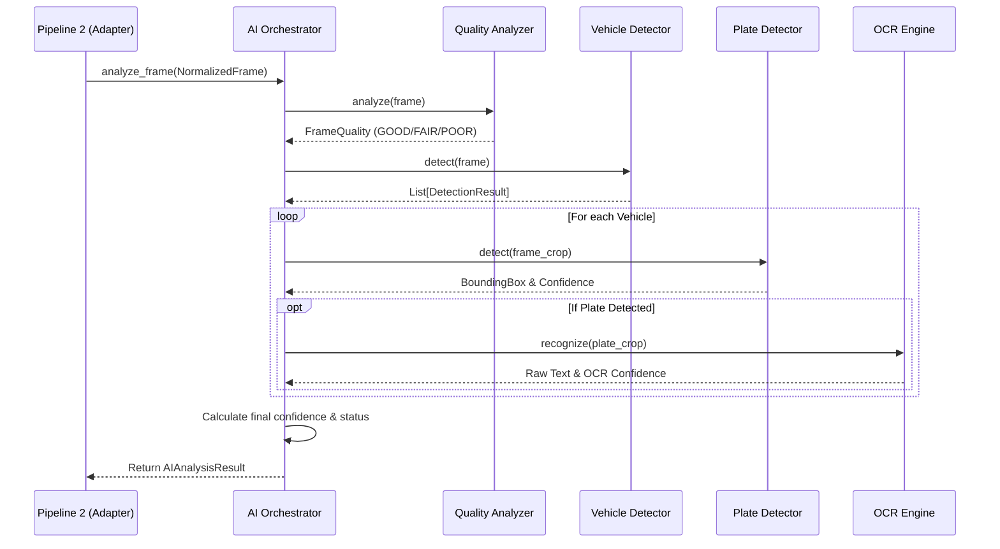

# AI Orchestration

**Status:** 🟢 IMPLEMENTED

The `AIOrchestrator` (`backend/ai/orchestrator.py`) is the brain of Pipeline 3. It controls the execution of AI models based on dynamic configurations, ensuring system efficiency.

## Core Responsibilities

1. **Provider Resolution:** It holds references to implementations of the AI Provider interfaces (currently mocks).
2. **Profile Filtering:** It reads `AI_PROFILES_CONFIG` to determine if a model should run. 
   - *Example:* A camera configured for `TRAFFIC` bypasses the `AnomalyDetector` entirely, saving GPU cycles.
3. **Pipeline Stitching:** It connects dependent models. It waits for the `VehicleDetector` to return bounding boxes before instructing the `PlateDetector` to scan those specific crops.
4. **Confidence Cascade:** It merges detector confidence, OCR confidence, and frame quality into a single `final_confidence` metric.

## Orchestration Flow Diagram

