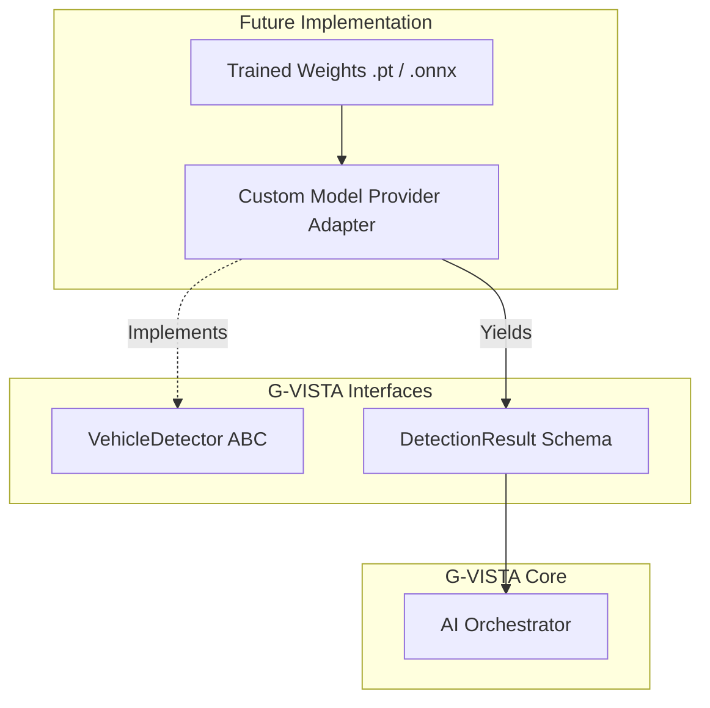

# Model Integration Guide

**Status:** 🟢 IMPLEMENTED (Framework)

The G-VISTA AI Orchestrator is completely model-agnostic. It does not contain hard-coded references to PyTorch, ONNX, or YOLO.

This document explains how a future teammate (an ML Engineer) integrates their custom trained models into the Pipeline.

## The Model Replacement Flow



## Step-by-Step Integration

### 1. Identify the Framework
Place the model file (e.g. `gujarat_police_yolov8.pt`) in `backend/ai/models/`.

### 2. Implement the Interface
Create a new file (e.g. `backend/ai/custom_providers.py`). 
Inherit from the relevant interface found in `backend/ai/interfaces.py`.

```python
from .interfaces import VehicleDetector
from .schemas import DetectionResult

class YOLOVehicleDetector(VehicleDetector):
    def __init__(self, model_path: str):
        # Load your model into VRAM once here
        self.model = load_my_model(model_path)
        
    def detect(self, frame, camera_uid, timestamp, frame_seq):
        # 1. Preprocess (resize, normalize)
        # 2. Infer
        results = self.model(frame)
        
        # 3. Format to Canonical Schema
        return [
            DetectionResult(
                detection_id="...",
                class_name="VEHICLE",
                confidence=float(results.conf),
                bbox=[x1, y1, x2, y2],
                # ...
                model_name="yolov8_gujarat_v1",
                model_provider="PYTORCH"
            )
        ]
```

### 3. Register the Provider
Update `backend/ai/orchestrator.py` to instantiate your new class instead of the Mock.

```python
# Change this:
self.vehicle_detector = MockVehicleDetector()

# To this:
self.vehicle_detector = YOLOVehicleDetector("backend/ai/models/gujarat_police_yolov8.pt")
```

## Requirements from the Model Developer
When handing over a model, the ML engineer must provide:
1. **Model Weights file.**
2. **Framework dependencies** (e.g., `ultralytics`, `onnxruntime`) to add to `requirements.txt`.
3. **Input Dimensions** (e.g., 640x640).
4. **Class Name Mappings** (e.g., `0 = car`, `1 = truck`).
5. **Confidence Thresholds** (so the Orchestrator config can be updated).
