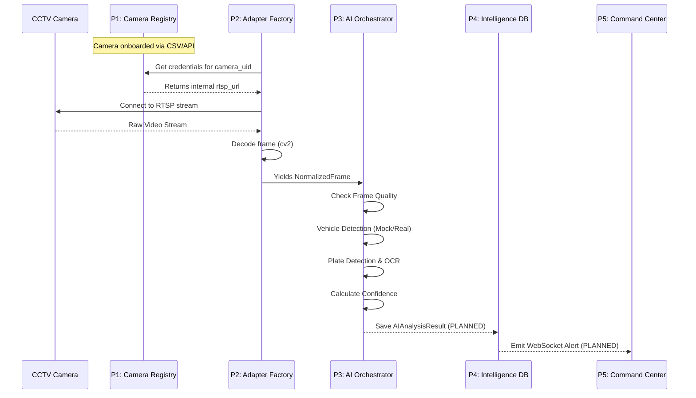

# End-to-End Data Flow

**Status:** 🟢 IMPLEMENTED (Pipelines 1-3) | ⚪ PLANNED (Pipelines 4-5)

This sequence diagram illustrates the lifecycle of a single video frame as it moves from physical hardware into actionable police intelligence.

## Flow Description

1. **Camera Registry (P1)** holds the truth about the camera's location and connection details.
2. **Adapter Factory (P2)** securely fetches the connection details (never exposing them to the frontend) and connects to the camera.
3. It standardizes the raw byte-stream into a `NormalizedFrame` (a numpy array with timestamps).
4. **AI Orchestrator (P3)** receives the frame, checks the camera's `AIProfile` (e.g. TRAFFIC), and routes it to the necessary providers.
5. The resulting insights (Vehicles, Plates, Anomalies) are bundled into an `AIAnalysisResult`.
6. *(PLANNED)* **Pipeline 4** will ingest this result, match it against watchlists, and store it.
7. *(PLANNED)* **Pipeline 5** will immediately alert the **Command Center**.
