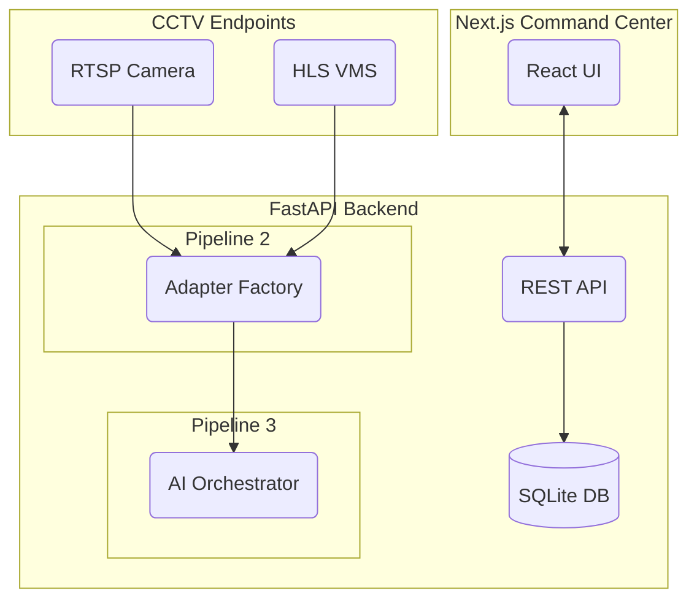
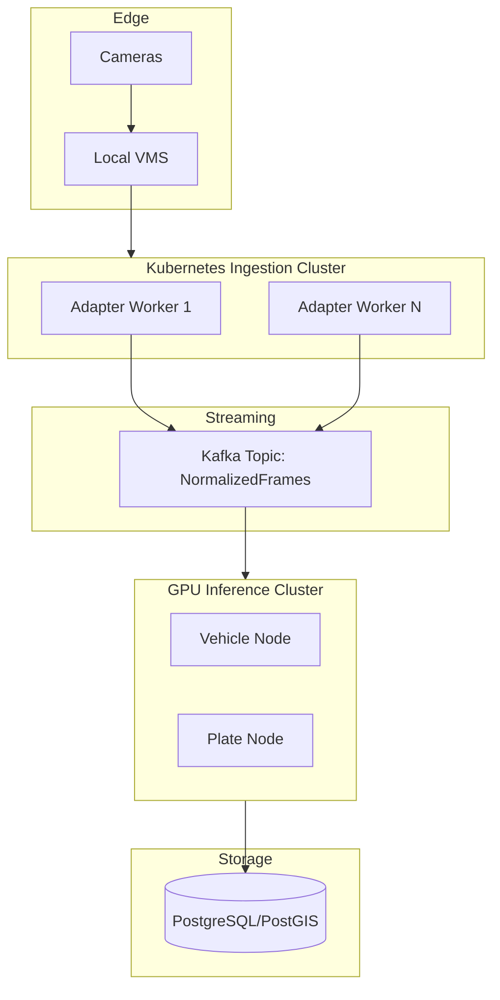

# High-Level Architecture

This document separates the current prototype implementation from the proposed production scaling model.

## 1. Current Prototype Architecture (Hackathon)
**Status:** 🟢 IMPLEMENTED

The current implementation runs as a monolithic backend (FastAPI) and a frontend web application (Next.js).

## 2. Production Architecture
**Status:** ⚪ PLANNED

To handle 80,000+ streams statewide, the architecture must transition to a distributed, horizontally scaled model.

### Production Layer Breakdown
- **Stream Ingestion (Adapter Workers):** Dedicated stateless pods that only run `RTSPAdapter` or `VendorSDKAdapter` to decode frames.
- **Message Broker:** Extracted frames are passed over Kafka.
- **AI Analytics:** GPU-backed workers that consume `NormalizedFrames` and apply TensorRT/ONNX models.
- **Intelligence Layer:** Services that query VAHAN/eGujCop based on the emitted `AIAnalysisResult`.
