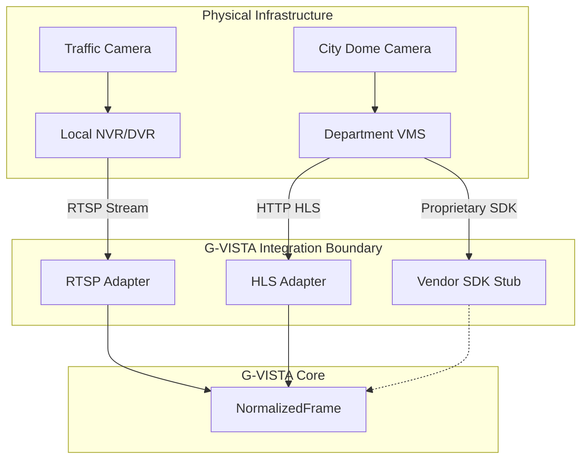

# Integration Boundary

**Status:** 🟢 IMPLEMENTED

The central philosophy of G-VISTA is that **we do not replace existing CCTV infrastructure.** 

## Where does G-VISTA connect?

G-VISTA acts entirely as a downstream consumer (a "pull" model). It integrates via existing network boundaries exposed by vendor equipment.

## Supported Boundaries

1. **RTSP (Real Time Streaming Protocol)**
   - **Status**: 🟢 IMPLEMENTED
   - We connect to the exact same RTSP URL that a desktop VMS client (like VLC or SmartPSS) would use.

2. **HLS (HTTP Live Streaming)**
   - **Status**: 🟢 IMPLEMENTED
   - We connect to `.m3u8` manifest URLs generated by modern web-first VMS solutions.

3. **ONVIF / Vendor SDKs**
   - **Status**: 🟠 STUBBED
   - The architecture supports calling proprietary Hikvision/Dahua C++ SDKs via Python wrappers, but these are currently implemented as boundary stubs returning `UNSUPPORTED` until authorized network hardware is available.

By integrating at the NVR/VMS level, G-VISTA avoids the complexity of physically networking to 80,000 distributed poles. It simply taps into the aggregated feeds at the district or departmental headquarters.
