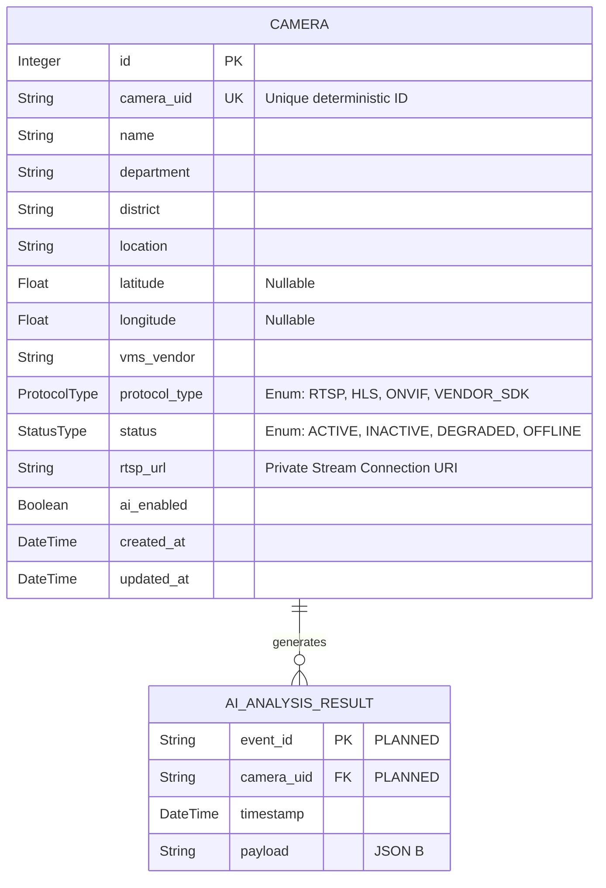

# Database Design

**Status:** 🟢 IMPLEMENTED (SQLite Prototype) | ⚪ PLANNED (PostgreSQL/PostGIS)

## Prototype Implementation
The current application uses SQLite with SQLAlchemy ORM (`backend/gvista.db`).

## ER Diagram

## Security Design
The `rtsp_url` is stored in plaintext in the SQLite prototype to allow local testing. In production, this field may be AES-encrypted at rest to prevent database dumps from leaking critical police stream credentials.

## Planned Production Migration
To support spatial tracking and 80,000+ camera scaling, the system will migrate to **PostgreSQL**.
- `latitude`/`longitude` will be converted to PostGIS `Geometry` types.
- Events will be indexed by space and time for rapid correlation.
