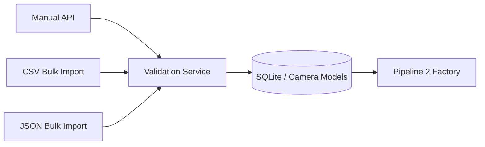

# Pipeline 1 — Camera Registry & Onboarding

**Status:** 🟢 IMPLEMENTED

## Purpose
Register and manage information about cameras without altering the underlying physical CCTV infrastructure. Pipeline 1 answers the question: *"What cameras do we have, where are they, and how do we connect to them?"*

## Architecture & Data Flow

## The Camera Model
The actual SQLAlchemy implementation in `backend/models.py` uses the following fields:
- `id` (Integer, Primary Key)
- `camera_uid` (String, Unique) — **Critical:** The deterministic ID used across the entire system.
- `name` (String)
- `department` (String)
- `district` (String)
- `location` (String)
- `latitude` / `longitude` (Float, Nullable)
- `vms_vendor` (String)
- `protocol_type` (Enum: RTSP, HLS, ONVIF, VENDOR_SDK)
- `status` (Enum: ACTIVE, INACTIVE, DEGRADED, OFFLINE)
- `rtsp_url` (String) — **Private / Secret**
- `ai_enabled` (Boolean)

## Onboarding Methods

### 1. Manual API
`POST /api/cameras/`
Allows single-camera creation via standard JSON payload. Validates the `ProtocolType` and `StatusType`.

### 2. JSON Bulk Import
`POST /api/cameras/bulk/json`
Accepts arrays of cameras. Uses **Idempotent Upserts**: if the `camera_uid` already exists, it updates the record. If it doesn't, it creates it.

### 3. CSV Bulk Import
`POST /api/cameras/bulk/csv`
Allows non-technical operators to upload spreadsheets of camera networks. Maps columns dynamically to the internal database schema.

### 4. Discovery Integration
*(⚪ PLANNED)* Future support for Sentinel auto-discovery adapters.

## Security Boundary
The most critical feature of Pipeline 1 is the separation of Public vs Private configuration.
- The `CameraResponse` Pydantic schema **excludes** the `rtsp_url`.
- Frontend users can view where a camera is, but they cannot extract the username/password required to connect to the raw stream.
