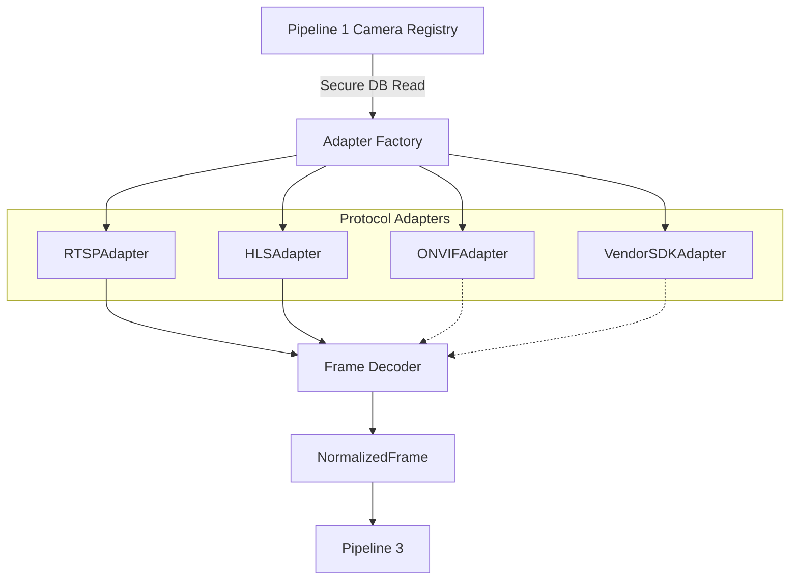

# Pipeline 2 — Protocol & Format Normalization Layer

**Status:** 🟢 IMPLEMENTED

## Purpose
While Pipeline 1 asks *"What cameras exist?"*, Pipeline 2 answers: *"How do we securely obtain frames from these cameras and convert them into a format AI models can understand?"*

It acts as an insulation layer. The downstream AI Engine does not need to know if a frame originated from an RTSP stream, an HTTP HLS manifest, or a proprietary C++ Vendor SDK.

## Architecture & Frame Normalization Flow

## The Adapter Factory
Located in `backend/adapters/factory.py`, the `AdapterFactory` is the secure boundary. It reads the internal `rtsp_url` from the database and instantiates the correct subclass of `CameraAdapter`.

## Protocol Adapters

### RTSP Adapter
- **Status:** 🟢 IMPLEMENTED
- **Implementation:** Uses headless `cv2.VideoCapture`. Connects to the URL, reads frames into numpy arrays, and handles connection timeouts gracefully without crashing the server.

### HLS Adapter
- **Status:** 🟢 IMPLEMENTED
- **Implementation:** Uses OpenCV HTTP Live Streaming (`.m3u8`) support. Functions identically to RTSP downstream.

### ONVIF Adapter
- **Status:** 🟠 STUB / UNSUPPORTED BOUNDARY
- **Implementation:** Present in the codebase as an explicit boundary, but safely returns `UNSUPPORTED`. Cannot be fully implemented until an authorized ONVIF device is available on the network.

### Vendor SDK Adapter
- **Status:** 🟠 STUB / UNSUPPORTED BOUNDARY
- **Implementation:** Exists to accommodate future Hikvision/Dahua/CP Plus SDK integration. Currently returns `UNSUPPORTED`.

## NormalizedFrame
Once a frame is decoded, it is packed into a `NormalizedFrame` dataclass (in `backend/adapters/models.py`).

**Fields:**
- `camera_uid`: `str`
- `frame`: `np.ndarray` (BGR format for AI)
- `timestamp`: `datetime`
- `width`: `int`
- `height`: `int`
- `source_protocol`: `str`
- `frame_sequence`: `int`

## Health States
Adapters are responsible for reporting their status via `/api/cameras/{uid}/adapter/health`:
- `ACTIVE`: Streaming successfully.
- `DEGRADED`: Connected but dropping frames/failing decodes.
- `OFFLINE`: Connection timeout or invalid credentials.
- `UNSUPPORTED`: Protocol boundary exists but logic is not implemented (e.g., Vendor SDK).
- `NOT_CONFIGURED`: Missing URL in the database.
