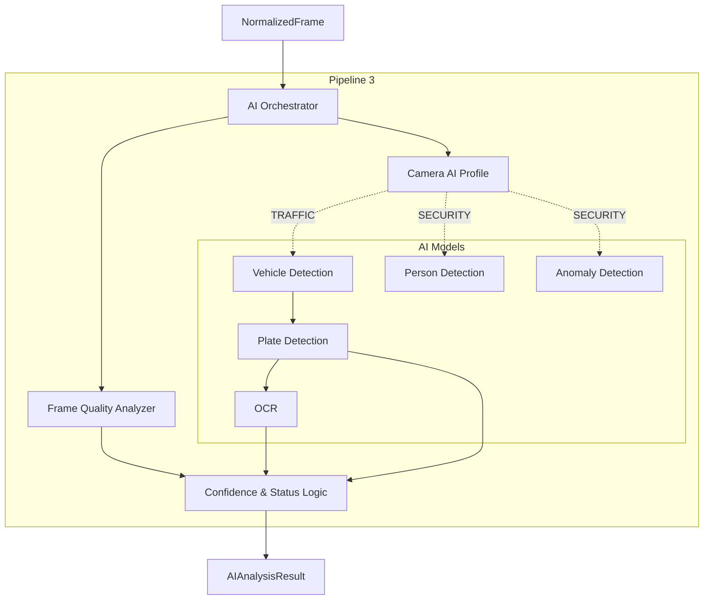

# Pipeline 3 — AI Video Analytics & Model Orchestration

**Status:** 🟢 IMPLEMENTED (Orchestrator Architecture) / 🔵 MOCK (Providers)

## Purpose
Pipeline 3 consumes the `NormalizedFrame` generated by Pipeline 2 and runs it through a series of configurable, orchestrated computer vision models. It outputs a purely structured data object (`AIAnalysisResult`) that future pipelines can index, search, and alert upon.

## Architecture

## AI Orchestrator & Profiles
The `AIOrchestrator` (`backend/ai/orchestrator.py`) remains entirely model-agnostic. 
It uses `AIProfiles` (`TRAFFIC`, `SECURITY`, `RTO`) defined in `config.py` to decide which detectors run.
For example, if a camera is assigned the `TRAFFIC` profile, the orchestrator skips `Person Detection` and `Anomaly Detection` entirely to save GPU resources.

## Model Independence (Mock vs Real)
The orchestrator relies strictly on Provider Interfaces (`backend/ai/interfaces.py`). 

Currently, the system uses **Mock Providers** (`MockVehicleDetector`, `MockOCRProvider`, etc.). These produce synthesized bounding boxes and plates to allow the orchestrator logic to be tested and perfected.

When a future teammate provides real models (whether YOLO `.pt`, TensorRT `.engine`, or `.onnx`), they will simply implement the interface adapter. The Orchestrator will not need to be rewritten.

## Data Schemas
Pipeline 3 standardizes the chaotic outputs of different AI frameworks into canonical Pydantic schemas (`backend/ai/schemas.py`):
- `DetectionResult`
- `PlateResult`
- `AnomalyResult`
- `AIAnalysisResult`
