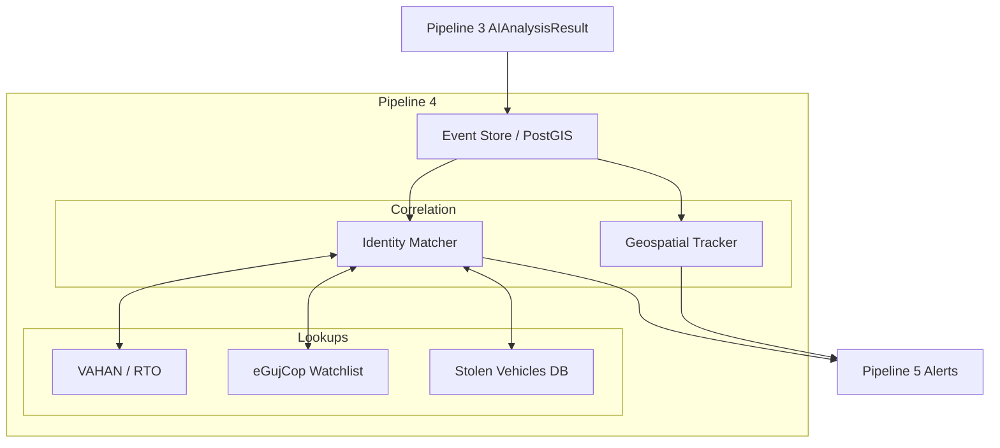

# Pipeline 4 — Intelligence & Correlation

**Status:** ⚪ PLANNED

## Purpose
Pipeline 4 serves as the analytical brain of G-VISTA. While Pipeline 3 asks *"What objects are in this frame?"*, Pipeline 4 asks *"Who do these objects belong to, and why should we care?"*

It ingests the `AIAnalysisResult` and correlates it against external state and national databases.

## Planned Data Flow

## Core Functions

1. **VAHAN / RTO Integration**: Convert the normalized OCR plate text into vehicle ownership details, registration status, and challan history.
2. **Watchlist Matching**: Compare recognized faces or number plates against active BOLO (Be On the Lookout) or stolen vehicle lists from eGujCop.
3. **GIS / Spatiotemporal Correlation**: Track a `camera_uid`'s physical coordinates to plot a vehicle's path across multiple districts over time.

## Database Transition
This pipeline necessitates the move from the current lightweight SQLite prototype to a robust PostgreSQL + PostGIS cluster, allowing for complex geographic radius queries and massive event-time series indexing.
