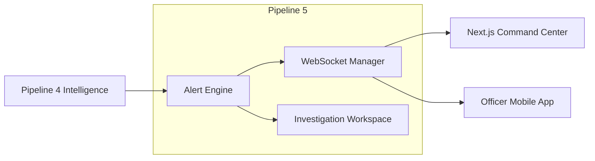

# Pipeline 5 — Alerts & Investigation

**Status:** ⚪ PLANNED

## Purpose
Pipeline 5 is the human-interface boundary of G-VISTA. It takes the enriched intelligence generated by Pipeline 4 and pushes it to police officers, command center operators, and ground units in real-time.

## Planned Data Flow

## Core Functions

1. **Alert Engine**: Evaluates severity. A stolen vehicle match generates a `CRITICAL` alert, whereas an expired registration might just be logged as `LOW`.
2. **WebSocket / Pub-Sub**: Instantly pushes alerts to the frontend Next.js Command Center without requiring the user to refresh the page.
3. **Investigation Workspace**: Allows an investigating officer to group multiple events (e.g., Plate XY from Camera A, Person Z from Camera B) into a logical "Case File".

## User Experience
The goal is to ensure an operator sitting at the central dashboard is notified the moment a flagged vehicle crosses an adapter-connected camera anywhere in the state, with the exact location and video snapshot instantly accessible.
