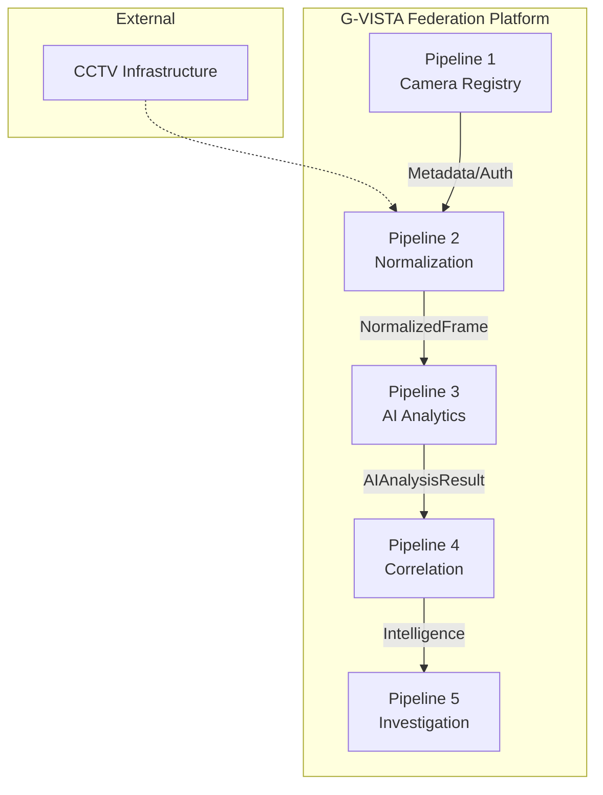

# Pipeline Overview

The G-VISTA system is conceptually and physically separated into five distinct pipelines. Each pipeline acts as a strict boundary, preventing monolithic tight-coupling.

## Pipeline 1: Camera Registry & Onboarding
**Status:** 🟢 IMPLEMENTED
- **Input:** CSV, JSON, Manual API entry.
- **Processing:** Validates and standardizes camera metadata. Protects `rtsp_url` and credentials.
- **Output:** Canonical `Camera` database records.

## Pipeline 2: Protocol & Format Normalization
**Status:** 🟢 IMPLEMENTED
- **Input:** Raw stream protocols (RTSP, HLS, Vendor SDK).
- **Processing:** securely retrieves credentials from Pipeline 1, decodes the raw stream using OpenCV or libraries.
- **Output:** `NormalizedFrame` (a standard NumPy array).

## Pipeline 3: AI Video Analytics & Orchestration
**Status:** 🟢 IMPLEMENTED (Orchestrator) / 🔵 MOCK (Providers)
- **Input:** `NormalizedFrame`.
- **Processing:** Passes frame through `AIOrchestrator` based on `AIProfile`. Computes frame quality, mock detections, and confidence.
- **Output:** `AIAnalysisResult` schema containing Detections, Plates, and Anomalies.

## Pipeline 4: Intelligence & Correlation
**Status:** ⚪ PLANNED
- **Input:** `AIAnalysisResult`.
- **Processing:** Will cross-reference detected number plates with RTO/VAHAN databases. Matches faces against eGujCop watchlists. Generates temporal paths across GIS data.
- **Output:** Enriched `Intelligence Event`.

## Pipeline 5: Alerts & Investigation
**Status:** ⚪ PLANNED
- **Input:** `Intelligence Event`.
- **Processing:** Pushes real-time WebSockets to the frontend. Manages case files and logical investigation boards.
- **Output:** Visual UI updates in the Command Center.
