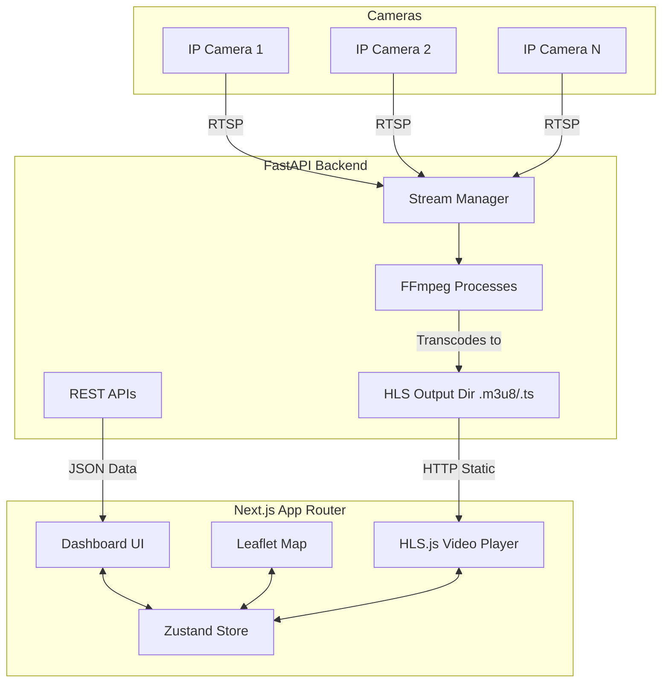

# Architecture

## System Overview
G-VISTA is a distributed web application consisting of a Next.js (React) frontend and a Python (FastAPI) backend. The system ingests RTSP video streams from various cameras, transcodes them into HLS format on the fly, and serves them to a high-performance web dashboard featuring real-time interactive mapping and AI analytics overlays.

## System Diagram

## Tech Stack
- **Frontend App**: Next.js (App Router), React, TypeScript.
- **Styling**: Tailwind CSS v4, Custom CSS Variables.
- **State Management**: Zustand.
- **Mapping**: Leaflet, react-leaflet, leaflet.markercluster.
- **Video Playback**: HLS.js.
- **Data Visualization**: Recharts, Framer Motion.
- **Backend API**: Python, FastAPI, Uvicorn.
- **Video Transcoding**: FFmpeg (invoked via Python `subprocess`).

## Repository Structure
- `/app`: Next.js frontend pages and layouts.
- `/components`: Frontend React components (cameras, dashboard, map, layout).
- `/lib`: Frontend utilities.
- `/backend`: Python backend containing `main.py`, routers, and video stream management logic.

## Application Layers
1. **Presentation Layer (Next.js)**: Responsible for rendering the UI, map, and handling user interactions.
2. **State Layer (Zustand)**: Manages global frontend state (selected cameras, alerts).
3. **API Layer (FastAPI)**: Exposes endpoints for camera metadata, health checks, and stream control.
4. **Media Layer (FFmpeg)**: Handles the heavy lifting of video transcoding from RTSP to HLS.

## Database Architecture
*Currently, the system relies on mock data or stateless in-memory structures for development. A formal database (e.g., PostgreSQL for metadata, Redis for pub/sub) may be integrated in future phases.*

## API Architecture
- RESTful principles using FastAPI.
- Routes are organized by domain: `/api/streams`, `/api/cameras`, `/api/health`.
- Static file serving is used for HLS chunks (`/hls/{camera_id}/index.m3u8`).

## External Services
- RTSP Camera Feeds (Ingress).
- OpenStreetMap or custom tile servers for Leaflet.

## Data Flow
1. User opens dashboard. Next.js serves the frontend.
2. Frontend requests camera list from FastAPI.
3. User selects a camera to view.
4. Frontend requests stream start from FastAPI (`/api/streams/start/{camera_id}`).
5. FastAPI spawns an FFmpeg process to consume the RTSP stream and output HLS files to a static directory.
6. Frontend `hls.js` player connects to the static HLS endpoint (`/hls/{camera_id}/index.m3u8`) and begins playback.

## Architectural Patterns
- **Backend-for-Frontend (BFF)**: The FastAPI backend acts as a specialized service to bridge raw IP cameras to web-friendly formats.
- **Client-Side Rendering for Video/Maps**: Next.js is used, but heavy interactive components (Leaflet, HLS.js) are strictly client-side (`'use client'`).

## System Boundaries
- **Python Backend**: Strictly handles stream ingestion, video processing, AI inference integration, and raw metadata serving.
- **Next.js Frontend**: Strictly handles UI rendering, state, routing, and user interaction.

## Scalability Considerations
- **FFmpeg Transcoding**: CPU intensive. The backend will require significant vertical scaling or horizontal distribution (e.g., a worker queue for stream processing) if scaling beyond a few concurrent streams.
- **Map Clustering**: `leaflet.markercluster` handles thousands of points efficiently on the client.

## Security Architecture
- CORS is restricted to frontend origins.
- Internal RTSP URLs are abstracted; the client only sees the public HLS URL.

## Deployment Architecture
- Frontend: Vercel or Node.js Docker container.
- Backend: Python Docker container with FFmpeg installed.
- Shared Volume: A shared volume or fast storage is needed between FFmpeg output and the web server serving the HLS static files.

## Constraints
- HLS introduces a slight latency (usually 2-5 seconds) compared to WebRTC, which is an accepted trade-off for architectural simplicity and caching capabilities.
