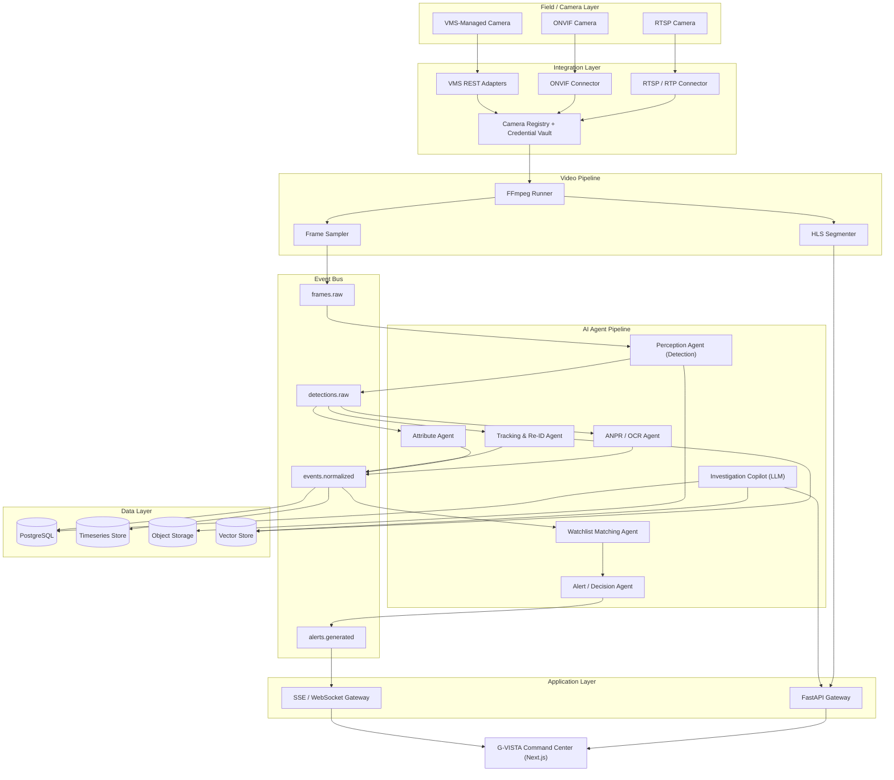
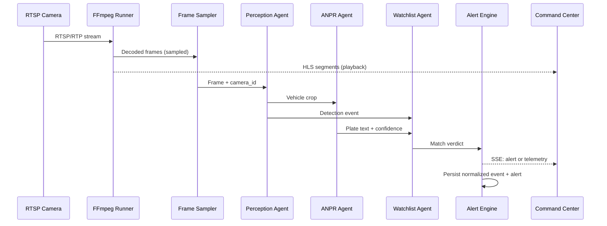
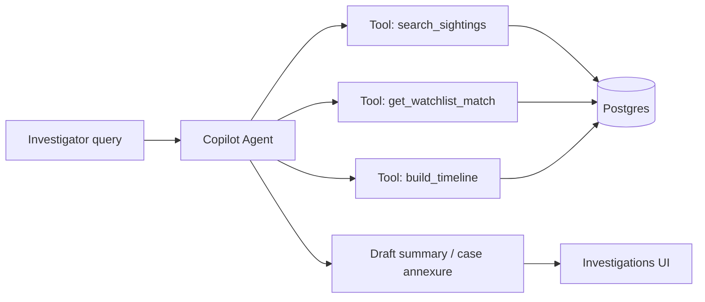
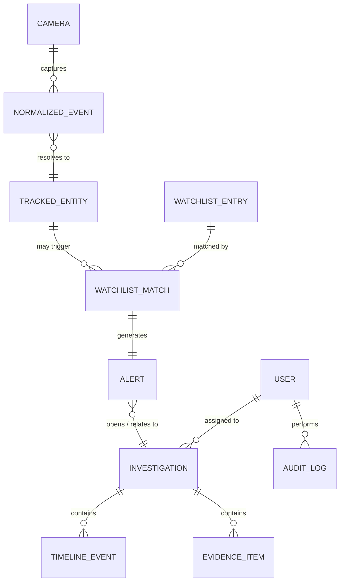

# G-VISTA Platform Blueprint

**Gujarat Video Intelligence & Surveillance Technology Architecture**
Product Requirements Document — the complete product, backend, AI-agent, protocol and dataset design for turning the current command-center prototype into an evaluation-ready live system.

| | |
|---|---|
| **Status** | Draft — Rev A |
| **Owner** | Engineering Team |
| **Target environment** | DEMO → LIVE |
| **Evaluation mode** | Live dataset |
| **Classification** | Internal |

> **Draft — internal review only — not yet validated against a live camera feed.**

---

## Table of Contents

1. [Executive Summary](#1-executive-summary)
2. [Baseline Audit — What Exists Today](#2-baseline-audit--what-exists-today)
3. [Goals, Non-Goals & Evaluation Framing](#3-goals-non-goals--evaluation-framing)
4. [Personas & Primary Use Cases](#4-personas--primary-use-cases)
5. [Design System](#5-design-system)
6. [Information Architecture](#6-information-architecture)
7. [High-Level System Architecture](#7-high-level-system-architecture)
8. [Backend & Protocols](#8-backend--protocols)
9. [AI Agent Pipeline](#9-ai-agent-pipeline)
10. [Data Model](#10-data-model)
11. [Dataset Strategy](#11-dataset-strategy)
12. [Security, Privacy & Compliance](#12-security-privacy--compliance)
13. [Non-Functional Requirements](#13-non-functional-requirements)
14. [Proposed File Structure](#14-proposed-file-structure)
15. [Delivery Roadmap](#15-delivery-roadmap)
16. [Success Metrics](#16-success-metrics)
17. [Risks & Open Questions](#17-risks--open-questions)

---

## 1. Executive Summary

**G-VISTA** is a state-scale video intelligence platform for Gujarat Police: it ingests feeds from an 80,000+ camera fleet across 33 districts, normalizes AI detections (vehicles, plates, people) into a single event schema, matches them against watchlists, raises alerts, and lets investigators trace an entity across cameras and open a case — all from one command-center UI.

The repository today is a **working demo**: a polished Next.js command center running entirely on a scripted mock dataset, plus a FastAPI backend that can genuinely pull one RTSP camera through FFmpeg into HLS. The AI layer — detection, OCR, watchlist matching — is stubbed with random mock outputs. That is the correct order of operations for a UI-first prototype, but the project is now moving into an **evaluation phase where a real, live camera/vehicle dataset will be supplied** and the system judged on how it behaves against it — not on how convincing the scripted demo looks.

This document specifies the complete design needed to make that jump: a design system audit (so new screens stay visually identical to the existing G-VISTA look), the full backend and AI-agent pipeline architecture, the wire protocols between every layer, the data model, a concrete dataset-sourcing plan for Indian roads and plates, and a phased delivery roadmap mapped to what an evaluator is likely to score.

| Metric | Value |
|---|---|
| Registered camera capacity | 80,000+ |
| Cameras wired to real video today | 1 |
| AI pipeline stages that are real | 0 / 4 |
| Frontend screens built | 10 / 10 |

---

## 2. Baseline Audit — What Exists Today

A candid read of the current codebase, so the rest of this PRD is understood as an extension of real work, not a rewrite from zero.

### Frontend (Next.js 16 / React 19)

Fully built and visually finished: dashboard, live cameras, alerts, watchlists, entity intelligence, analytics, investigations, camera network, system health, audit/security and settings pages, all driven by `lib/mock-data.ts` and orchestrated by a scripted `lib/demo-engine.ts` state machine. This is production-grade UI — the design system section below documents it precisely so nothing drifts when real data lands.

### Backend (FastAPI) — `backend/ai/detection_service.py` and friends

This is the file under review. Line by line, it is an intentional placeholder, not a bug:

| Component | File | Current behavior | Status |
|---|---|---|---|
| `DetectionService.detect_frame` | `backend/ai/detection_service.py` | Ignores the input frame; returns one fake `VEHICLE` box 10% of calls via `random.random()`. No model is loaded. | **Mock** |
| `OCRService.read_plate` | `backend/ai/detection_service.py` | Returns the literal string `GJ05XX7821` (the demo's own stolen-vehicle plate) 30% of the time. Cannot read a real plate. | **Mock** |
| `simulate_ai_pipeline` | `backend/routers/streams.py` | Runs every 2s while a stream is LIVE, but calls detection on a literal `b"fake_image_data"` — frames are never actually extracted from the FFmpeg/HLS output. | **Not wired** |
| `AlertEngine.process_event` | `backend/intelligence/alert_engine.py` | "Watchlist match" is a single hardcoded string comparison (`== "GJ05XX7821"`), not a lookup against any watchlist store. | **Mock** |
| `CameraRegistry` | `backend/integration/camera_registry.py` | Reads RTSP credentials from env vars and registers exactly one hardcoded camera. Correctly keeps credentials server-side and out of `get_all()`. | **Real, single-camera** |
| `FFmpegRunner` / `StreamManager` | `backend/video/` | Genuine RTSP→HLS transcode via subprocess, ffprobe capability detection, crash detection with capped auto-restart/backoff. | **Real** |
| Frontend → backend wiring | `app/cameras/page.tsx` | Polls `/api/streams/{id}/status` every 2s but never calls `POST /api/streams/{id}/start` — in LIVE mode the player currently has no way to actually start a stream. | **Gap** |

**Net read:** the plumbing (process management, HLS, SSE transport, camera registry, restart logic) is solid and worth keeping. The intelligence (detection, OCR, matching) is 100% placeholder and is the entire scope of the work described in [§9 AI Agent Pipeline](#9-ai-agent-pipeline) and [§11 Dataset Strategy](#11-dataset-strategy) below.

---

## 3. Goals, Non-Goals & Evaluation Framing

### In scope

- Real object/vehicle/person detection and Indian ANPR on live or supplied recorded feeds
- Multi-protocol camera ingestion: RTSP, ONVIF, at least one VMS REST adapter
- Cross-camera entity tracking, watchlist fuzzy-matching, alerting, and case/investigation workflow
- An LLM-backed investigation copilot for natural-language case queries
- A dataset fine-tuning & evaluation loop for whatever live dataset the evaluators provide
- Security basics: credential vault, RBAC, immutable audit log

### Explicitly out of scope (v1)

- Facial recognition / biometric identification (legal exposure — see [§12](#12-security-privacy--compliance))
- Actually operating 80,000 physical cameras — the number is a design target, not a pilot requirement
- PTZ camera control, two-way audio, edge NVR firmware integration
- Mobile field-officer app (web-responsive command center only)

### How this will be evaluated

The brief explicitly states this is judged with a **live dataset**, not the scripted demo. That reframes every design decision in this document: the AI pipeline must degrade gracefully on real, messy footage (motion blur, night IR, partial plates, two-wheelers with two-line plates) rather than being tuned to look perfect on one staged clip. Every pipeline stage below therefore ships with a stated accuracy target, a fallback behavior, and a metric an evaluator can independently check.

---

## 4. Personas & Primary Use Cases

| Persona | Context | Primary use case |
|---|---|---|
| Control room operator | District command center, multi-monitor wall | Watch the live camera grid, triage incoming alerts, escalate to field units |
| Field investigator (PI/Inspector) | Assigned an open case | Trace a vehicle/person across cameras, assemble evidence, ask the copilot for a timeline summary |
| ACP / DSP (command staff) | Regional oversight | Read district health & analytics, review critical alerts, approve high-sensitivity actions (e.g. face-match gate) |
| System administrator | Platform ops | Register cameras, monitor stream/agent health, review audit logs |
| Evaluator / judge | External, time-boxed session | Feed a live/recorded dataset in, confirm detections and alerts correspond to ground truth, inspect architecture |

---

## 5. Design System

This is not a new visual direction — it is the exact system already implemented in `app/globals.css`, documented so every future screen (watchlist editor, copilot chat, dataset console) stays native to G-VISTA.

### Palette

Dark-first "operations center" palette with a single cyan accent and four semantic status colors reused everywhere — badges, map clusters, detection boxes, alert severity dots.

| Token | Hex | Use |
|---|---|---|
| BG Primary | `#080c12` | App background |
| BG Panel | `#111827` | Cards, sidebar |
| Accent Cyan | `#0ea5e9` | Primary accent, active states, AI activity |
| Status Online | `#10b981` | Healthy / confirmed match |
| Status Warning | `#f59e0b` | Degraded / high severity |
| Status Critical | `#ef4444` | Critical / offline |
| Status Info | `#8b5cf6` | Medium severity / informational |

### Typography

- **UI & body — Inter** (400–800 weight range). Every heading, label and paragraph in the product.
- **Data & identifiers — JetBrains Mono**. Plates, camera IDs, timestamps, telemetry counters — anything the operator must read exactly (e.g. `GJ05XX7821`).

### Core components to reuse (never re-invent)

- **Badges** — `.badge-online/offline/degraded/critical/high/medium/low/info`, 10px uppercase, tinted background at 15% opacity over a 30% border.
- **Glass panels** — `.glass-panel` / `-elevated` / `-accent` for every card, drawer and modal.
- **Telemetry numbers** — `.telemetry-number` in JetBrains Mono for every stat tile (see `KeyMetricsRow.tsx`).
- **Detection overlays** — `.detection-box.vehicle/person/plate` already color-codes AI output; the real pipeline must emit boxes in this exact shape so the overlay code needs zero changes.
- **Demo/status stripe banner** — the diagonal amber stripe pattern is the house style for "mode" callouts; reuse it for a future *LIVE MODE — UNVALIDATED FEED* banner rather than inventing a new one.

---

## 6. Information Architecture

The ten routes that exist today, what they currently render from, and what "done" means once real data is wired in.

| Route | Purpose | Data source today | Target for live evaluation |
|---|---|---|---|
| `/` (Command Center) | Map + live metrics + alert feed overview | Scripted demo engine | Live SSE feed driving map markers and the metrics row |
| `/cameras` | Camera grid, live playback | Mock grid + 1 real HLS player | All registered cameras; auto-calls `/start`; detection overlays from real boxes |
| `/alerts` | Incident triage list | `ALERTS` mock array | Postgres-backed, paginated, filterable by district/severity |
| `/watchlists` | Manage stolen-vehicle / wanted-person entries | `WATCHLIST_ENTRIES` mock array | CRUD against watchlist service; bulk CSV import from state DB export |
| `/intelligence` | Entity search & relationship graph | Static demo vehicle/person | Query interface over the entity graph + copilot chat |
| `/analytics` | Event volume, trend charts | `EVENTS_TIMESERIES` random data | Aggregations from the timeseries store |
| `/investigations/[id]` | Case file: timeline, evidence, related entities | `DEMO_INVESTIGATION` | Real case records + copilot-drafted summaries |
| `/network` | Camera fleet map by connector type | `CONNECTOR_TYPES` mock | Live per-camera protocol/health status from the registry |
| `/health` | System health dashboard | `SYSTEM_HEALTH` mock | `/api/health` + per-agent/queue health (Prometheus) |
| `/security` | Audit log viewer | Not implemented | Append-only audit log with hash chaining (see [§12](#12-security-privacy--compliance)) |
| `/settings` | Platform configuration | Not implemented | Camera onboarding, RBAC role management, model version pinning |

---

## 7. High-Level System Architecture

Six layers: field cameras, an integration layer that speaks every camera protocol, a video pipeline, an event-driven AI agent pipeline, a data layer, and the existing Next.js command center on top.



**Why an event bus instead of the current direct-call design.** Today `simulate_ai_pipeline` calls detection → OCR → alert engine directly, in-process, per camera. That's fine for one camera; it does not survive a second GPU worker or a second machine. Putting `frames.raw` / `detections.raw` / `events.normalized` / `alerts.generated` on Kafka or Redis Streams turns every agent into a horizontally-scalable consumer group and decouples video ingestion speed from AI inference speed — critical once the evaluation dataset has more than one camera's worth of footage queued up.

---

## 8. Backend & Protocols

### Camera integration protocols

| Protocol | Used for | Notes | Status |
|---|---|---|---|
| RTSP / RTP | Direct IP camera streams | Already implemented via FFmpeg + TCP transport in `ffmpeg_runner.py` | **Real** |
| ONVIF (Profile S/T) | Vendor-neutral discovery, stream URI negotiation | Needed for camera auto-onboarding instead of hand-coded env vars per camera | Planned |
| VMS REST APIs | Hikvision HikCentral/ISAPI, Dahua DSS, Bosch VMS, Genetec, Axis Camera Station | One adapter per vendor behind a common `VMSAdapter` interface; only implement the vendor present in the evaluation dataset first | Planned |
| HLS | Browser playback of transcoded feed | Implemented; 2–6s latency, acceptable for a review UI | **Real** |
| WebRTC (future) | Sub-second playback for active pursuit scenarios | Only worth building if the evaluation explicitly scores live latency | Future |
| SSE | One-way event/alert push to the UI | Implemented at `/api/streams/events/stream`, unused by the frontend today | Built, unconsumed |
| WebSocket | Bidirectional — copilot chat, future PTZ commands | Add alongside SSE for the investigation copilot only | Planned |
| gRPC | Internal agent-to-agent calls | Typed, low-overhead — use between Perception → ANPR/Tracking agents once split into separate processes | Planned |
| Kafka / Redis Streams | Event bus backbone | Redis Streams is the pragmatic choice for the evaluation build; Kafka if scale-out beyond a handful of workers is demonstrated | Planned |

### REST / streaming API surface

| Method & Path | Purpose | Status |
|---|---|---|
| `GET /api/cameras` | List registered cameras (credential-safe) | **Real** |
| `POST /api/streams/{id}/start` | Start FFmpeg ingest + AI pipeline for a camera | Not called by frontend |
| `POST /api/streams/{id}/stop` | Stop ingest, release resources | **Real** |
| `GET /api/streams/{id}/status` | Poll FPS/latency/uptime/restart count | **Real** |
| `GET /api/streams/events/stream` | SSE feed of normalized events + alerts | Built, unconsumed |
| `GET /api/health` | CPU/RAM/FFmpeg availability | **Real** |
| `GET/POST /api/watchlists` | CRUD watchlist entries | Missing |
| `GET/POST /api/investigations` | Case file CRUD + timeline append | Missing |
| `POST /api/copilot/query` | Natural-language investigation queries (WS or REST) | Planned |
| `POST /api/auth/login` | Session/JWT issuance, role claims | Missing |

---

## 9. AI Agent Pipeline

"Agent" here means a bounded, independently-scalable service with one job, consuming and producing bus topics — plus one genuine LLM agent for investigation support. This directly replaces `detection_service.py` and `alert_engine.py`'s mock logic.

| Agent | Input | Output | Method | Latency budget |
|---|---|---|---|---|
| Perception Agent | Sampled frame (~1–5 fps) | Bounding boxes: vehicle, person, class | YOLOv8/v9-nano or -small, fine-tuned | < 80ms/frame (GPU) |
| ANPR / OCR Agent | Vehicle crop | Plate text + char confidence | Plate detector (small YOLO) + CRNN/PaddleOCR reader, fine-tuned on Indian plates | < 120ms/crop |
| Attribute Agent | Person/vehicle crop | Color, type, clothing, direction | Lightweight multi-label classifier | < 60ms/crop |
| Tracking & Re-ID Agent | Detections across frames/cameras | Stable `object_id`, cross-camera journey | ByteTrack (intra-camera) + soft-biometric Re-ID embedding (inter-camera) | < 40ms/frame |
| Watchlist Matching Agent | Normalized event (plate/attributes) | Match / no-match + confidence | Exact match + Levenshtein/Jaro-Winkler fuzzy match (tolerates 1–2 OCR errors) | < 10ms/event |
| Alert / Decision Agent | Match verdicts | Deduplicated, severity-scored, routed alert | Rule engine (replaces the hardcoded string check in `alert_engine.py`) | < 20ms/event |
| Investigation Copilot | Operator natural-language query | Draft timeline / case summary / answer | LLM + tool-calling (RAG over entity graph & event store) | < 3s/query |



### Investigation Copilot — the genuine "agent AI"

Every other agent above is classic computer vision. The copilot is the one true LLM agent: it sits behind the Investigations page, holds tool-calling access to the entity graph and event store, and turns "show me everywhere this vehicle was seen after 9pm" into a query plan, then a plain-language, citation-backed answer — and can draft a first-pass case summary an investigator edits rather than writes from scratch.



**Guardrail:** the copilot never auto-files or auto-closes a case — every output lands as a draft an investigator must accept, and every tool call is written to the audit log.

---

## 10. Data Model

Extends the TypeScript types already defined in `lib/types.ts` into a persisted relational schema — the frontend interfaces do not need to change shape.



- **PostgreSQL** — cameras, watchlist entries, alerts, investigations, users/roles, audit log. Source of truth for anything a human edits.
- **Timeseries store** (TimescaleDB or ClickHouse) — high-volume `NormalizedEvent` stream, powers the Analytics page's real charts instead of `EVENTS_TIMESERIES`'s `Math.random()`.
- **Object storage** (S3-compatible / MinIO) — evidence snapshots and clips referenced by `EvidenceItem.evidenceId`.
- **Vector store** (pgvector or a dedicated ANN index) — Re-ID embeddings for cross-camera matching and the copilot's semantic search over case notes.

---

## 11. Dataset Strategy

The most consequential section given the evaluation format: the pipeline must perform on Indian roads with real, unfamiliar footage — not just the demo's staged clip.

### Pretraining / transfer sources by task

| Task | Recommended dataset(s) | Why it fits |
|---|---|---|
| General vehicle/person detection | COCO, BDD100K, UA-DETRAC | Strong generic pretrained backbones (YOLOv8/v9) to fine-tune from |
| Indian road/traffic realism | **IDD — India Driving Dataset** (IIIT Hyderabad) | The only major dataset with Indian road density, autorickshaws, two-wheeler dominance and lane discipline patterns the live cameras will actually show |
| License plate detection + OCR | Curated Indian ANPR sets (Kaggle "Indian Vehicle Number Plate" collections, Roboflow Universe "India ANPR" projects) + active-learning labels pulled from the supplied live dataset itself | Indian plates vary wildly: HSRP vs. legacy, single- vs. two-line (common on two-wheelers), state-code prefixes — generic ALPR models (built for US/EU/Chinese plates) under-perform without this |
| Person re-identification | Market-1501, MSMT17 | Standard Re-ID benchmarks; avoid DukeMTMC-reID (withdrawn over consent concerns) — noted so nobody quietly pulls it in later |
| Soft-biometric attributes | PA-100K, RAP | Clothing/attribute labels without requiring face recognition — the privacy-safe default path (see [§12](#12-security-privacy--compliance)) |
| Low-light / adverse weather robustness | ExDark (low light), Rain100/RainCityscapes, or synthetic Albumentations augmentation | State CCTV feeds run 24/7; night IR and monsoon footage must not silently zero out detection confidence |
| Suspicious-activity / anomaly cues | UCF-Crime, ShanghaiTech Campus, Avenue | Seeds for the "SUSPICIOUS_ACTIVITY" event type beyond simple object detection |

### Onboarding the evaluator-supplied live dataset

1. **Ingest & profile** — run the pretrained baseline pipeline against a sample to measure baseline detection/OCR accuracy and identify failure modes (glare, blur, plate angle).
2. **Human-in-the-loop labeling** — correct the baseline's output in CVAT or Label Studio rather than labeling from scratch; this is materially faster and is the industry-standard active-learning loop.
3. **Fine-tune** — a short fine-tune of the detection and ANPR models on the corrected labels, versioned with DVC and tracked in MLflow/Weights & Biases so every submitted result is reproducible.
4. **Hold out a validation split** before fine-tuning and never train on it — this is the number reported to evaluators, not a training-set number.
5. **Report standard metrics**: mAP@0.5 for detection, plate-level exact-match accuracy + character error rate for ANPR, Rank-1/mAP for Re-ID, precision/recall for watchlist alerting, and end-to-end event-to-alert latency.

> **Why this matters more than model choice.** A judge handing over a live dataset is testing whether the team can *adapt*, not whether they memorized one architecture. The onboarding loop above — profile, label, fine-tune, validate, report — is the deliverable; it should be scripted and demonstrable in minutes, not something done manually the night before.

---

## 12. Security, Privacy & Compliance

- **Credential vault** — RTSP/VMS credentials move from plain environment variables (current `camera_registry.py`) into a secrets manager (HashiCorp Vault or cloud KMS); the registry only ever holds a reference.
- **RBAC** — control-room operator, investigator, ACP/DSP, and admin roles with route- and district-scoped permissions; the copilot inherits the caller's scope, never elevated access.
- **Immutable audit log** — every alert view, case action, and copilot query hash-chains into the `/security` page's log so it is tamper-evident — relevant for evidentiary chain-of-custody, not just IT hygiene.
- **Face recognition — gated, not default** — biometric facial matching carries direct exposure under India's *Digital Personal Data Protection Act, 2023* and the Puttaswamy privacy judgment. Default to soft-biometric attributes (clothing, gait, build) for person re-identification; any face-match capability must sit behind an explicit, logged authorization workflow with a named approving officer, not be silently on by default.
- **Data residency** — snapshots/clips and watchlist data stay in-country; no default third-party cloud AI API for frame processing given the sensitivity of the data.

---

## 13. Non-Functional Requirements

| Dimension | Target |
|---|---|
| Event-to-alert latency | < 3 seconds, camera to command-center alert render |
| Stream resilience | Auto-reconnect within 3 attempts / 5s backoff (already implemented in `StreamManager`) — extend the same policy to the AI agents |
| Horizontal scale | Each agent independently scalable via consumer groups; demonstrate at least 10 concurrent camera pipelines for evaluation, not 80,000 |
| Observability | Prometheus metrics per agent (throughput, latency, queue depth) + Grafana dashboard feeding the real `/health` page |
| Graceful degradation | If an AI agent is down, video/HLS playback continues uninterrupted — detection is additive, never blocking |
| Accessibility | Keyboard-navigable command center, visible focus states, color never the sole signal (pair every status color with an icon/label as the current badge system already does) |

---

## 14. Proposed File Structure

### `backend/` — proposed layout

```
backend/
├── app/
│   ├── main.py
│   ├── core/                 # config.py, logging.py, security.py
│   ├── api/v1/routers/       # cameras, streams, alerts, watchlists,
│   │                         # investigations, copilot, auth, health
│   ├── integrations/
│   │   ├── rtsp/
│   │   ├── onvif/
│   │   ├── vms_adapters/     # hikvision.py, dahua.py, bosch.py, genetec.py
│   │   └── camera_registry.py
│   ├── video/
│   │   ├── ffmpeg_runner.py   # existing, kept
│   │   ├── stream_manager.py  # existing, kept
│   │   └── frame_sampler.py   # NEW — extracts real frames for AI
│   ├── agents/
│   │   ├── perception_agent.py
│   │   ├── anpr_agent.py
│   │   ├── attribute_agent.py
│   │   ├── tracking_agent.py
│   │   ├── watchlist_agent.py
│   │   ├── alert_agent.py
│   │   ├── investigation_copilot/
│   │   │   ├── agent.py
│   │   │   ├── tools.py
│   │   │   └── prompts.py
│   │   └── orchestrator.py    # bus wiring / consumer groups
│   ├── intelligence/
│   │   ├── events.py           # existing, kept
│   │   ├── alert_engine.py      # rewritten: rule engine, not string ==
│   │   ├── watchlist_matcher.py # NEW — fuzzy match logic
│   │   └── entity_graph.py
│   ├── ml/
│   │   ├── detection/          # inference.py, train.py, weights/
│   │   ├── ocr/
│   │   ├── reid/
│   │   └── datasets/           # DVC pointers, not raw data
│   ├── db/
│   │   ├── base.py
│   │   ├── models/              # camera, event, alert, investigation, watchlist, user
│   │   ├── migrations/          # alembic
│   │   └── repositories/
│   ├── workers/                 # Kafka/Redis Streams consumers
│   └── tests/
├── infra/
│   ├── docker-compose.yml
│   ├── k8s/
│   └── prometheus/
└── requirements/                # base.txt, dev.txt, ml.txt
```

### `frontend/` — targeted additions only

```
app/                        # unchanged routes
components/
├── investigations/
│   └── CopilotChat.tsx      # NEW
└── watchlists/
    └── WatchlistEditor.tsx  # NEW
lib/
├── api/
│   ├── client.ts             # NEW — typed fetch wrapper
│   ├── sse.ts                # NEW — consumes /api/streams/events/stream
│   └── ws.ts                 # NEW — copilot chat socket
├── mock-data.ts               # kept, explicitly DEMO-mode only
└── mode.ts                    # unchanged
store/                       # NEW — zustand is already a dependency,
                              # currently unused; adopt it for live
                              # alert/camera state instead of prop drilling
```

---

## 15. Delivery Roadmap

- **Phase 0 — Current state** *(Done)*
  Full mock-driven UI, single-camera RTSP→HLS pipeline, stubbed AI.

- **Phase 1 — Real single-camera pipeline** *(Next)*
  Wire `/cameras` to call `/start`; real frame sampler; fine-tuned YOLO + ANPR replacing the mock services; events persisted to Postgres; basic auth.

- **Phase 2 — Scale-out**
  Event bus (Redis Streams/Kafka), multi-camera ingestion, tracking/Re-ID agent, fuzzy watchlist matcher.

- **Phase 3 — Intelligence & investigations**
  Entity graph, investigation copilot, RBAC, immutable audit log, DPDP compliance review.

- **Phase 4 — Evaluation hardening**
  Fine-tune against the supplied live dataset, load-test, Grafana dashboards, failover drills, judge-facing demo run-through.

---

## 16. Success Metrics

| Evaluation dimension | What proves it |
|---|---|
| Real-data handling | Detection/ANPR metrics reported on a held-out split of the supplied dataset, not the demo clip |
| Architecture depth & scalability | Event bus demo with ≥2 concurrent camera pipelines and independent agent scaling |
| UI/UX & domain fidelity | Every live screen visually indistinguishable from the existing G-VISTA design system |
| Innovation | Working investigation copilot answering a real natural-language query with cited sightings |
| Security & compliance awareness | Credential vault, RBAC, audit log, and an explicit face-recognition policy statement |
| Demo robustness | Graceful degradation demonstrated live (kill an agent, playback continues; disconnect a camera, auto-reconnect visible) |

---

## 17. Risks & Open Questions

- **Unknown camera protocol mix** — the exact VMS/vendor in the evaluation environment isn't known yet; build the `VMSAdapter` interface first, implement the specific vendor last, once confirmed.
- **Indian plate OCR accuracy** — two-line plates on two-wheelers and non-HSRP legacy plates are the most likely failure mode; budget labeling time specifically for these, not just standard four-wheeler plates.
- **Bandwidth/compute for the live demo venue** — confirm whether inference runs on GPU on-site or needs to be CPU-viable (affects model size choice: YOLOv8n vs. larger variants).
- **Face recognition pressure** — if evaluators expect biometric identification, the gated-by-default policy in [§12](#12-security-privacy--compliance) needs to be explained as a deliberate compliance choice, not a missing feature.
- **Dataset licensing** — confirm redistribution terms of any third-party dataset (IDD, Market-1501, etc.) used for pretraining before including weights/derivatives in a public submission.

---

*G-VISTA Blueprint · Rev A · Draft — Prepared for internal engineering review, not an operational deployment document.*
